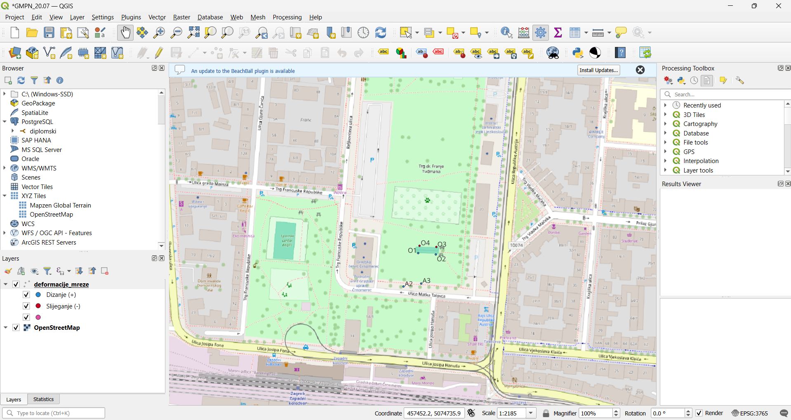

# Analiza deformacija nivelmanske mreže — Hannover metoda

Ovaj repozitorij sadrži računalne programe pisane u programskom jeziku Python za izjednačenje 1D nivelmanske mreže po metodi najmanjih kvadrata te detekciju i lokalizaciju nestabilnih točaka u sklopu deformacijske analize (PANDA/DEFANA model).

## Vizualizacija rezultata

## Sadržaj repozitorija

Repozitorij obuhvaća slijedeće komponente:

1. **`deformacijska_analiza(OOP_20.07).py` (Glavna skripta):**
   - Objektno-orijentirana arhitektura koda s klasama za unos mjerenja, izjednačenje metodom najmanjih kvadrata i statističko testiranje.
   - Primjena Hannover metode za sukcesivnu identifikaciju i eliminaciju nestabilnih točaka iz referentne osnove.
   - Automatski izvoz izračunatih pomaka u `.geojson` format za vizualizaciju u GIS okruženju (QGIS) te `.txt` izvještaj s numeričkim pokazateljima.

2. **Popratne datoteke:**
   - `panda_report.pdf` — Izvorni izvještaji izjednačenja i deformacijske analize iz programa PANDA/DEFANA.
   - `deformacije_mreze.geojson` — Generirani vektorski sloj s vektorima pomaka za QGIS.
   - `izvjestaj_deformacije.txt` — Tekstualni izvoz izračunatih parametara i statističkih testova.

## Metodologija i statistički testovi

- **Izjednačenje slobodne mreže:** Rješavanje rang-defekta mreže primjenom Moore-Penroseovog pseudo-inverza.
- **Statistička analiza:**
  - Test homogenosti varijanci iz dviju epoha mjerenja .
  - Globalni test deformacija mreže.
  - Hannoverska lokalizacija pomaka pojedinih točaka uz zadanu razinu značajnosti $\alpha = 0.05$.

## Rezultati analize

Analizom mjernih podataka iz dviju epoha identificirane su sljedeće nestabilne točke u mreži:
- **O4** — uvrštena u skupinu pomaknutih točaka (slijeganje)
- **O3** — uvrštena u skupinu pomaknutih točaka (slijeganje)

Dobiveni rezultati podudaraju se s rezultati softwara PANDA/DEFANA u izjednačenju iznosima pomaka i globalnome pomaku, do ne slaganja dolazi kod lokalizacije točaka, pošto PANDA koristi T-test dok je ovdje prisutan samo F-test.
